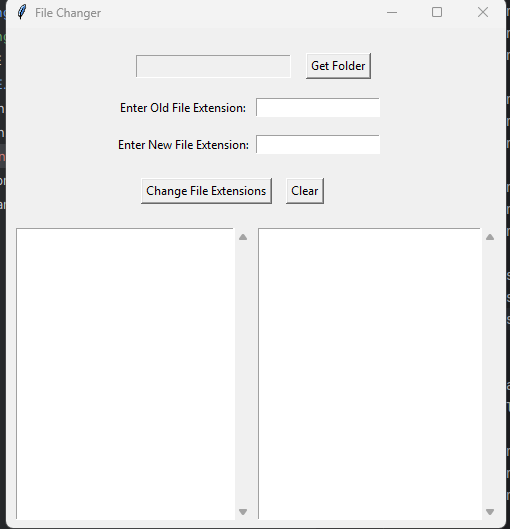

# FileChanger

### This application gives the user the ability to change the file extensions of files.

---

****

#### **Figure 1: UI Screenshot.**

---

### Note: Put the executable file inside the folder you want to work in. 
#### Currently, this only works with image file types.

# Instructions:

**1: Download the latest release from the right side.**

**2: Click on the FileChanger.exe file.**

**3: To load a folder, click the "Browse Files" option and select a file.**

**4: To change the file extensions:**

- **Enter Old File Extension:** Enter the file extension of the files from the folder that you'd like to change from.
- **Enter New File Extension:** Enter the file extension of the files from the folder that you'd like to change to.

**5: Press the Change File Extensions button to change the file extensions.**

**6: To clear the UI screen: press the "Clear" button.** 